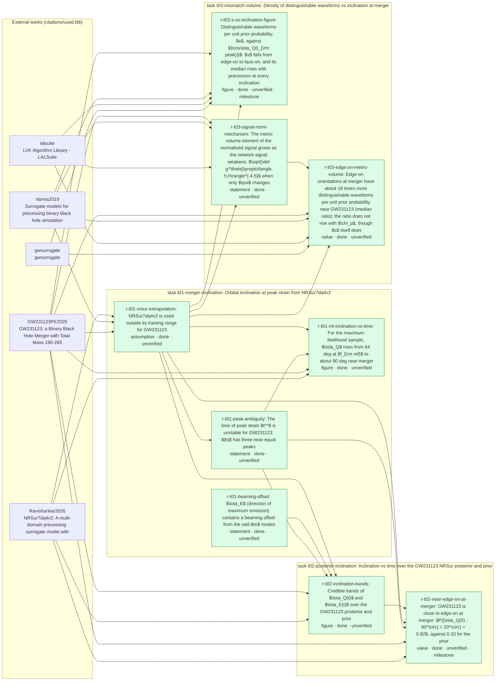

<!-- GENERATED by `opsci map build` from the node headers. Do not edit this file; edit the headers. -->

# Claims graph

The logic of the project's results. Arrows: `A --> B` means result B rests on A (a result,
a task, a dataset, or an external work from `citations/used.bib`). Each result sits in a box
with the task it came from. Dotted arrows point from a new result to the one it supersedes.
Colour shows the status; a thick red border marks a result that rests on failed, superseded
or abandoned work and may no longer hold. Hexagons are verification tasks, with a dotted
arrow to each result they verify.

## May no longer hold

None: every live result rests only on live work.

## Results

`chain` is the lowest verification level among the result and every result it rests on.

| result | kind | status | verification | chain | statement | task | stored in | code | rests on | used by |
|---|---|---|---|---|---|---|---|---|---|---|
| [r-t01-beaming-offset](../tasks/t01-merger-inclination/results/r-t01-beaming-offset.md) | statement | done | unverified | unverified | The direction of maximum emission is not the orbital axis when odd-$m$ modes are present: for an aligned-spin $q = 1.5$ control the offset is $3.3^\circ$ at $t^* - 500\,M$ and $5.6^\circ$ at $t^*$. $\iota_E$ therefore differs from $\iota_Q$ by this beaming offset as well as by any frame difference. | [t01-merger-inclination](../tasks/t01-merger-inclination/context.md) | [`tasks/t01-merger-inclination/subcontext/S2_controls.md`](../tasks/t01-merger-inclination/subcontext/S2_controls.md) | [`src/tests/test_controls.py`](../src/tests/test_controls.py), [`src/merger_inclination/inclination.py`](../src/merger_inclination/inclination.py) | [t01-merger-inclination](../tasks/t01-merger-inclination/context.md) | [r-t02-inclination-bands](../tasks/t02-posterior-inclination/results/r-t02-inclination-bands.md) |
| [r-t01-ml-inclination-vs-time](../tasks/t01-merger-inclination/results/r-t01-ml-inclination-vs-time.md) | figure | done | unverified | unverified | ML sample 6096 of C00:NRSur7dq4 ($\iota = 64.3^\circ$ at $f_{\rm ref} = 10$ Hz): $\iota_Q(t)$ reaches a maximum of $89.1^\circ$ (v2) / $90.0^\circ$ (v1) at $t \approx -6\,M$. At the strain peak $t^*$, $\iota_Q = 81.8^\circ$ (v2, $t^* = -27\,M$) or $89.8^\circ$ (v1, $t^* = -2.7\,M$). | [t01-merger-inclination](../tasks/t01-merger-inclination/context.md) | [`tasks/t01-merger-inclination/S3/fig2_inclination_vs_time_2026-09-25.png`](../tasks/t01-merger-inclination/S3/fig2_inclination_vs_time_2026-09-25.png), [`tasks/t01-merger-inclination/S3/result_C00-NRSur7dq4_NRSur7dq4v2_2026-09-25.json`](../tasks/t01-merger-inclination/S3/result_C00-NRSur7dq4_NRSur7dq4v2_2026-09-25.json), [`tasks/t01-merger-inclination/S3/result_C00-NRSur7dq4_NRSur7dq4_2026-09-25.json`](../tasks/t01-merger-inclination/S3/result_C00-NRSur7dq4_NRSur7dq4_2026-09-25.json), `data/t01-merger-inclination/S3/result_C00-NRSur7dq4_NRSur7dq4v2_2026-09-25.series.npz` (not published) | [`src/merger_inclination/inclination.py`](../src/merger_inclination/inclination.py), [`src/merger_inclination/frames.py`](../src/merger_inclination/frames.py), [`tasks/t01-merger-inclination/S3/plots.py`](../tasks/t01-merger-inclination/S3/plots.py) | [r-t01-nrsur-extrapolation](../tasks/t01-merger-inclination/results/r-t01-nrsur-extrapolation.md), [r-t01-peak-ambiguity](../tasks/t01-merger-inclination/results/r-t01-peak-ambiguity.md), [@GW231123PE2025], [@Ravishankar2026] |  |
| [r-t01-nrsur-extrapolation](../tasks/t01-merger-inclination/results/r-t01-nrsur-extrapolation.md) | assumption | done | unverified | unverified | Every inclination in this project comes from NRSur7dq4v2 (and NRSur7dq4 as a cross-check). The GW231123 maximum-likelihood spins, 0.96 and 0.99, lie outside the surrogate training range ($\chi \le 0.8$); the LVK parameter estimation used the same extrapolated model, so the posterior rests on the same assumption. | [t01-merger-inclination](../tasks/t01-merger-inclination/context.md) | [`tasks/t01-merger-inclination/S3/result_C00-NRSur7dq4_NRSur7dq4v2_2026-09-25.json`](../tasks/t01-merger-inclination/S3/result_C00-NRSur7dq4_NRSur7dq4v2_2026-09-25.json) | [`src/merger_inclination/waveform.py`](../src/merger_inclination/waveform.py) | [t01-merger-inclination](../tasks/t01-merger-inclination/context.md), [@Ravishankar2026], [@Varma2019], [@GW231123PE2025] | [r-t01-ml-inclination-vs-time](../tasks/t01-merger-inclination/results/r-t01-ml-inclination-vs-time.md), [r-t01-peak-ambiguity](../tasks/t01-merger-inclination/results/r-t01-peak-ambiguity.md), [r-t02-inclination-bands](../tasks/t02-posterior-inclination/results/r-t02-inclination-bands.md), [r-t02-near-edge-on-at-merger](../tasks/t02-posterior-inclination/results/r-t02-near-edge-on-at-merger.md), [r-t03-edge-on-metric-volume](../tasks/t03-mismatch-volume/results/r-t03-edge-on-metric-volume.md), [r-t03-s-vs-inclination-figure](../tasks/t03-mismatch-volume/results/r-t03-s-vs-inclination-figure.md), [r-t03-signal-norm-mechanism](../tasks/t03-mismatch-volume/results/r-t03-signal-norm-mechanism.md) |
| [r-t01-peak-ambiguity](../tasks/t01-merger-inclination/results/r-t01-peak-ambiguity.md) | statement | done | unverified | unverified | For the ML sample, $\|h_+ - i h_\times\|$ along the line of sight has three peaks within 1-9 % of each other, at $t = -27, -13, -3\,M$. NRSur7dq4v2 and NRSur7dq4 agree on $\iota_Q$ at each peak (82, 87-88, 89-90 deg) but choose different peaks as highest (margins 1-2 %). An inclination "at peak strain" is therefore ill-defined; t02 reports $\iota$ at $t = 0$ of the model time axis instead. | [t01-merger-inclination](../tasks/t01-merger-inclination/context.md) | [`tasks/t01-merger-inclination/S3/fig1_strain_amplitude_2026-09-25.png`](../tasks/t01-merger-inclination/S3/fig1_strain_amplitude_2026-09-25.png), [`tasks/t01-merger-inclination/S3/peak_candidates_2026-09-25.json`](../tasks/t01-merger-inclination/S3/peak_candidates_2026-09-25.json) | [`tasks/t01-merger-inclination/S3/peak_candidates.py`](../tasks/t01-merger-inclination/S3/peak_candidates.py) | [r-t01-nrsur-extrapolation](../tasks/t01-merger-inclination/results/r-t01-nrsur-extrapolation.md) | [r-t01-ml-inclination-vs-time](../tasks/t01-merger-inclination/results/r-t01-ml-inclination-vs-time.md), [r-t02-inclination-bands](../tasks/t02-posterior-inclination/results/r-t02-inclination-bands.md), [r-t02-near-edge-on-at-merger](../tasks/t02-posterior-inclination/results/r-t02-near-edge-on-at-merger.md) |
| [r-t02-inclination-bands](../tasks/t02-posterior-inclination/results/r-t02-inclination-bands.md) | figure | done | unverified | unverified | Pointwise 68 % and 90 % bands of $\iota_Q(t)$, $\iota_E(t)$ against $t/M$ for all 18185 posterior samples and 5000 prior draws. The prior bands are flat in $t$ (control). The posterior $\iota$ is bimodal about $90^\circ$, so the band median of $\iota$ is misleading; the folded $\|\iota - 90^\circ\|$ plot is unimodal. $\iota_Q$ is constant for $t > +20\,M$ in every sample (cause not tested): do not read the post-merger part. | [t02-posterior-inclination](../tasks/t02-posterior-inclination/context.md) | [`tasks/t02-posterior-inclination/S3/bands_2026-09-25.png`](../tasks/t02-posterior-inclination/S3/bands_2026-09-25.png), [`tasks/t02-posterior-inclination/S3/folded_bands_2026-09-25.png`](../tasks/t02-posterior-inclination/S3/folded_bands_2026-09-25.png), `data/t02-posterior-inclination/post_2026-09-25.npz` (not published), `data/t02-posterior-inclination/prior_2026-09-25.npz` (not published) | [`src/merger_inclination/batch.py`](../src/merger_inclination/batch.py), [`tasks/t02-posterior-inclination/S3/aggregate.py`](../tasks/t02-posterior-inclination/S3/aggregate.py) | [r-t01-nrsur-extrapolation](../tasks/t01-merger-inclination/results/r-t01-nrsur-extrapolation.md), [r-t01-beaming-offset](../tasks/t01-merger-inclination/results/r-t01-beaming-offset.md), [r-t01-peak-ambiguity](../tasks/t01-merger-inclination/results/r-t01-peak-ambiguity.md), [@GW231123PE2025], [@Ravishankar2026] | [r-t02-near-edge-on-at-merger](../tasks/t02-posterior-inclination/results/r-t02-near-edge-on-at-merger.md) |
| [r-t02-near-edge-on-at-merger](../tasks/t02-posterior-inclination/results/r-t02-near-edge-on-at-merger.md) | value | done | unverified | unverified | Over the 18185 C00:NRSur7dq4 posterior samples, the median $\|\iota_Q - 90^\circ\|$ falls from $39.0^\circ$ at $f_{\rm ref}$ to $12.6^\circ$ at $t = 0$ (minimum $8.2^\circ$ at $t = -12\,M$). $P(\|\iota_Q(0) - 90^\circ\| < 20^\circ) = 0.82$ (posterior) vs 0.33 (prior); at $f_{\rm ref}$ the posterior value is 0.027. The prior distribution does not change with time. | [t02-posterior-inclination](../tasks/t02-posterior-inclination/context.md) | [`tasks/t02-posterior-inclination/S3/t0_hist_2026-09-25.png`](../tasks/t02-posterior-inclination/S3/t0_hist_2026-09-25.png), [`tasks/t02-posterior-inclination/S3/summary_2026-09-25.json`](../tasks/t02-posterior-inclination/S3/summary_2026-09-25.json), `data/t02-posterior-inclination/post_2026-09-25.npz` (not published), `data/t02-posterior-inclination/prior_2026-09-25.npz` (not published) | [`src/merger_inclination/batch.py`](../src/merger_inclination/batch.py), [`tasks/t02-posterior-inclination/S3/aggregate.py`](../tasks/t02-posterior-inclination/S3/aggregate.py) | [r-t02-inclination-bands](../tasks/t02-posterior-inclination/results/r-t02-inclination-bands.md), [r-t01-nrsur-extrapolation](../tasks/t01-merger-inclination/results/r-t01-nrsur-extrapolation.md), [r-t01-peak-ambiguity](../tasks/t01-merger-inclination/results/r-t01-peak-ambiguity.md), [@GW231123PE2025], [@Ravishankar2026] |  |
| [r-t03-edge-on-metric-volume](../tasks/t03-mismatch-volume/results/r-t03-edge-on-metric-volume.md) | value | done | unverified | unverified | For 8000 prior draws in the GW231123 mass window, the density of distinguishable NRSur7dq4 waveforms per unit prior probability, $s$, is larger edge-on at merger ($\|\iota_Q(0) - 90^\circ\| < 20^\circ$) than elsewhere. Ratio of medians $R_{\rm edge} = 18$ (68 %: 16-20); by $\chi_p$ bin 20.7, 16.5, 12.2 (the ratio does not rise, although the median of $s$ rises with $\chi_p$ at every inclination, `r-t03-s-vs-inclination-figure`). The ratio of means (the plan's definition) is $\sim 2\times10^3$ but not converged: the 10 largest of 2697 edge-on points hold 91 % of the sum. Among posterior samples the ratio of medians is 1.13 (1.03-1.21). | [t03-mismatch-volume](../tasks/t03-mismatch-volume/context.md) | [`tasks/t03-mismatch-volume/S3/fig1_s_vs_cos_W_2026-09-25.png`](../tasks/t03-mismatch-volume/S3/fig1_s_vs_cos_W_2026-09-25.png), [`tasks/t03-mismatch-volume/S3/fig2_s_vs_cos_P_2026-09-25.png`](../tasks/t03-mismatch-volume/S3/fig2_s_vs_cos_P_2026-09-25.png), [`tasks/t03-mismatch-volume/S3/fig3_Nrho_nuisance_W_2026-09-25.png`](../tasks/t03-mismatch-volume/S3/fig3_Nrho_nuisance_W_2026-09-25.png), [`tasks/t03-mismatch-volume/S3/summary_2026-09-25.json`](../tasks/t03-mismatch-volume/S3/summary_2026-09-25.json), `data/t03-mismatch-volume/win_2026-09-25.npz` (not published), `data/t03-mismatch-volume/post_2026-09-25.npz` (not published) | [`src/mismatch_metric/metric.py`](../src/mismatch_metric/metric.py), [`src/mismatch_metric/batch.py`](../src/mismatch_metric/batch.py), [`tasks/t03-mismatch-volume/S3/aggregate.py`](../tasks/t03-mismatch-volume/S3/aggregate.py) | [r-t03-signal-norm-mechanism](../tasks/t03-mismatch-volume/results/r-t03-signal-norm-mechanism.md), [r-t01-nrsur-extrapolation](../tasks/t01-merger-inclination/results/r-t01-nrsur-extrapolation.md), [@GW231123PE2025], [@Varma2019], [@lalsuite], [@gwsurrogate] |  |
| [r-t03-s-vs-inclination-figure](../tasks/t03-mismatch-volume/results/r-t03-s-vs-inclination-figure.md) | figure | done | unverified | unverified | For 8000 prior draws in the GW231123 mass window, $\log_{10}s$ falls from edge-on to face-on in every $\chi_p$ bin (medians by 1.8-2.4 decades). In the median, $s$ rises with precession at every inclination: the $\chi_p\ge0.7$ bin lies 2.2-2.8 decades above the $\chi_p<0.4$ bin, of which 0.8-1.2 decades come from $\sqrt{\det g^\theta}$. The rise is about the same at all inclinations, so the edge-on ratio $R_{\rm edge}$ does not rise with $\chi_p$. The means are not converged. | [t03-mismatch-volume](../tasks/t03-mismatch-volume/context.md) | [`tasks/t03-mismatch-volume/S3/fig1_s_vs_cos_W_tpeak_2026-09-25.png`](../tasks/t03-mismatch-volume/S3/fig1_s_vs_cos_W_tpeak_2026-09-25.png), [`tasks/t03-mismatch-volume/S3/chi_p_trend_2026-09-25.json`](../tasks/t03-mismatch-volume/S3/chi_p_trend_2026-09-25.json), [`tasks/t03-mismatch-volume/S3/summary_2026-09-25.json`](../tasks/t03-mismatch-volume/S3/summary_2026-09-25.json), `data/t03-mismatch-volume/win_2026-09-25.npz` (not published) | [`src/mismatch_metric/metric.py`](../src/mismatch_metric/metric.py), [`src/mismatch_metric/batch.py`](../src/mismatch_metric/batch.py), [`tasks/t03-mismatch-volume/S3/aggregate.py`](../tasks/t03-mismatch-volume/S3/aggregate.py), [`tasks/t03-mismatch-volume/S3/fig1_tpeak.py`](../tasks/t03-mismatch-volume/S3/fig1_tpeak.py) | [r-t01-nrsur-extrapolation](../tasks/t01-merger-inclination/results/r-t01-nrsur-extrapolation.md), [@GW231123PE2025], [@Varma2019], [@lalsuite], [@gwsurrogate] |  |
| [r-t03-signal-norm-mechanism](../tasks/t03-mismatch-volume/results/r-t03-signal-norm-mechanism.md) | statement | done | unverified | unverified | Over 8000 window prior draws, $\log\sqrt{\det g^\theta}$ falls with the network $\langle h,h\rangle$ at fixed distance (Spearman $-0.65$); edge-on orientations have median $\langle h,h\rangle$ 0.29 times that of the others, and the 20 largest $s$ have $\langle h,h\rangle$ at 0.5-16 % of the median. Controlled test: varying $\psi$ alone at the 3 largest-$s$ points changes $\langle h,h\rangle$ by 40-80x and $\tfrac12\ln\det g^\theta$ with slope $-3.8$ to $-4.5$ per $\ln\langle h,h\rangle$, near the $-9/2$ of nine directions each scaling as $1/\langle h,h\rangle$. | [t03-mismatch-volume](../tasks/t03-mismatch-volume/context.md) | [`tasks/t03-mismatch-volume/S3/fig4_logdet_vs_signal_norm_W_2026-09-25.png`](../tasks/t03-mismatch-volume/S3/fig4_logdet_vs_signal_norm_W_2026-09-25.png), [`tasks/t03-mismatch-volume/S3/psi_scan_2026-09-25.json`](../tasks/t03-mismatch-volume/S3/psi_scan_2026-09-25.json), `data/t03-mismatch-volume/signal_norm_2026-09-25.npz` (not published) | [`tasks/t03-mismatch-volume/S3/signal_norm.py`](../tasks/t03-mismatch-volume/S3/signal_norm.py), [`tasks/t03-mismatch-volume/S3/psi_scan.py`](../tasks/t03-mismatch-volume/S3/psi_scan.py), [`tasks/t03-mismatch-volume/S3/aggregate.py`](../tasks/t03-mismatch-volume/S3/aggregate.py) | [r-t01-nrsur-extrapolation](../tasks/t01-merger-inclination/results/r-t01-nrsur-extrapolation.md), [@GW231123PE2025], [@Varma2019], [@lalsuite] | [r-t03-edge-on-metric-volume](../tasks/t03-mismatch-volume/results/r-t03-edge-on-metric-volume.md) |

## External works

| key | title | used by |
|---|---|---|
| [@GW231123PE2025] | GW231123: a Binary Black Hole Merger with Total Mass 190-265 Msun | [r-t01-ml-inclination-vs-time](../tasks/t01-merger-inclination/results/r-t01-ml-inclination-vs-time.md), [r-t01-nrsur-extrapolation](../tasks/t01-merger-inclination/results/r-t01-nrsur-extrapolation.md), [r-t02-inclination-bands](../tasks/t02-posterior-inclination/results/r-t02-inclination-bands.md), [r-t02-near-edge-on-at-merger](../tasks/t02-posterior-inclination/results/r-t02-near-edge-on-at-merger.md), [r-t03-edge-on-metric-volume](../tasks/t03-mismatch-volume/results/r-t03-edge-on-metric-volume.md), [r-t03-s-vs-inclination-figure](../tasks/t03-mismatch-volume/results/r-t03-s-vs-inclination-figure.md), [r-t03-signal-norm-mechanism](../tasks/t03-mismatch-volume/results/r-t03-signal-norm-mechanism.md) |
| [@Ravishankar2026] | NRSur7dq4v2: A multi-domain precessing surrogate model with improved accuracy | [r-t01-ml-inclination-vs-time](../tasks/t01-merger-inclination/results/r-t01-ml-inclination-vs-time.md), [r-t01-nrsur-extrapolation](../tasks/t01-merger-inclination/results/r-t01-nrsur-extrapolation.md), [r-t02-inclination-bands](../tasks/t02-posterior-inclination/results/r-t02-inclination-bands.md), [r-t02-near-edge-on-at-merger](../tasks/t02-posterior-inclination/results/r-t02-near-edge-on-at-merger.md) |
| [@Varma2019] | Surrogate models for precessing binary black hole simulations with unequal masses | [r-t01-nrsur-extrapolation](../tasks/t01-merger-inclination/results/r-t01-nrsur-extrapolation.md), [r-t03-edge-on-metric-volume](../tasks/t03-mismatch-volume/results/r-t03-edge-on-metric-volume.md), [r-t03-s-vs-inclination-figure](../tasks/t03-mismatch-volume/results/r-t03-s-vs-inclination-figure.md), [r-t03-signal-norm-mechanism](../tasks/t03-mismatch-volume/results/r-t03-signal-norm-mechanism.md) |
| [@gwsurrogate] | gwsurrogate | [r-t03-edge-on-metric-volume](../tasks/t03-mismatch-volume/results/r-t03-edge-on-metric-volume.md), [r-t03-s-vs-inclination-figure](../tasks/t03-mismatch-volume/results/r-t03-s-vs-inclination-figure.md) |
| [@lalsuite] | LVK Algorithm Library - LALSuite | [r-t03-edge-on-metric-volume](../tasks/t03-mismatch-volume/results/r-t03-edge-on-metric-volume.md), [r-t03-s-vs-inclination-figure](../tasks/t03-mismatch-volume/results/r-t03-s-vs-inclination-figure.md), [r-t03-signal-norm-mechanism](../tasks/t03-mismatch-volume/results/r-t03-signal-norm-mechanism.md) |
