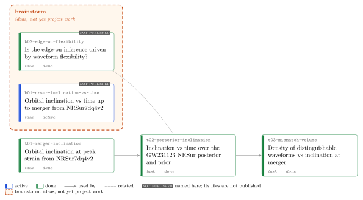

<!-- GENERATED by `opsci map build` from the node headers. Do not edit this file; edit the headers. -->

# Project graph

Each card is a node; its colour shows the status. An arrow from A to B means B depends on
A; an arrow that a longer path of arrows already implies is left out (the table lists
every dependency). Dashed arrows point from a node to the node that superseded it, and
from a node to the verification task that verified it. Dotted lines join related nodes.
The nodes in the `brainstorm` box are ideas under that directory, not yet project work.
The 9 results in `results/` directories, and what they rest on, are in [the claims graph](claims.md).

## Nodes

| id | title | type | status | verification | depends on | summary |
|---|---|---|---|---|---|---|
| b01-nrsur-inclination-vs-time (not published) | Orbital inclination vs time up to merger from NRSur7dq4v2 | task | active | unverified |  | NRSur7dq4v2 returns the coprecessing-frame quaternion on its full time grid, so the angle between that frame's z-axis and the line of sight can be computed up to the amplitude peak; after the peak the frame is frozen by construction. |
| b02-edge-on-flexibility (not published) | Is the edge-on inference driven by waveform flexibility? | task | done | unverified |  | Graduated 2026-09-25 to project task t03-mismatch-volume (mismatch-metric volume vs inclination at merger). Literature: hypothesis untested in print. |
| [t01-merger-inclination](../tasks/t01-merger-inclination/context.md) · [map](../tasks/t01-merger-inclination/map.md) | Orbital inclination at peak strain from NRSur7dq4v2 | task | done | unverified |  | Done 2026-09-25. GW231123 NRSur ML sample (iota = 64.3 deg at f_ref = 10 Hz): iota_Q rises to a maximum of 89-90 deg at t ~ -6 M; at t* iota_Q = 81.8 deg (v2, t* = -27 M) or 89.8 deg (v1, t* = -2.7 M), because three near-equal peaks of \|h\| make t* unstable. Convention gate vs LAL passes (6e-5). |
| [t02-posterior-inclination](../tasks/t02-posterior-inclination/context.md) · [map](../tasks/t02-posterior-inclination/map.md) | Inclination vs time over the GW231123 NRSur posterior and prior | task | done | unverified | `t01-merger-inclination` | Done: over all 18185 posterior samples the median \|iota_Q - 90 deg\| falls from 39 deg at f_ref to 12.6 deg at t = 0; P(\|iota_Q(0) - 90\| < 20 deg) = 0.82 vs 0.33 for the prior, whose distribution is time-independent (control). S3/results.md. |
| [t03-mismatch-volume](../tasks/t03-mismatch-volume/context.md) · [map](../tasks/t03-mismatch-volume/map.md) | Density of distinguishable waveforms vs inclination at merger | task | done | unverified | `t02-posterior-inclination`, `t01-merger-inclination` | Done 2026-09-25. Edge-on orientations at merger have more distinguishable NRSur7dq4 waveforms per unit prior probability near GW231123: ratio of medians $R_{\rm edge}=18$ (68 %: 16-20), not rising with $\chi_p$, although the median of $s$ rises with $\chi_p$ by 2.2-2.8 decades at every inclination (milestone figure); the ratio of means is not converged. The excess tracks weak network signal ($\sqrt{\det g}\propto\langle h,h\rangle^{-4.5}$ when only $\psi$ changes). Among posterior samples the ratio is 1.13. |

## Other links

- `b02-edge-on-flexibility` is related to `t02-posterior-inclination`.
