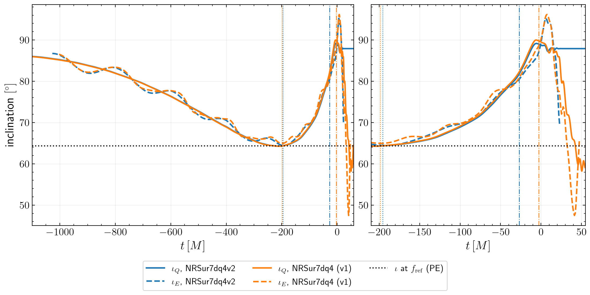
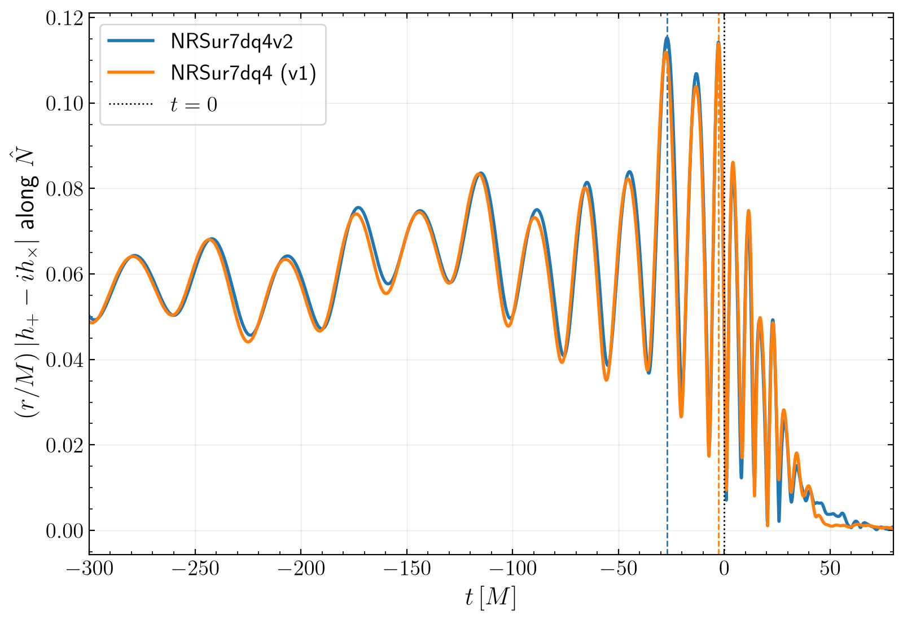

<!-- GENERATED by `opsci map build` from the node headers. Do not edit this file; edit the headers. -->

# Results: Orbital inclination at peak strain from NRSur7dq4v2

The scientific results of this task: the figures, tables, values and statements it
established, not the plots and numbers of debugging runs. Each result has its own file
here, `<result-id>.md`, with a `type: result` header (fields: `tasks/README.md`). This page
is generated from those headers. What each result rests on, across the project: [the claims graph](../../../map/claims.md).

## r-t01-beaming-offset: $\iota_E$ (direction of maximum emission) contains a beaming offset from the odd-$m$ modes

*statement · done · unverified*

The direction of maximum emission is not the orbital axis when odd-$m$ modes are present: for an aligned-spin $q = 1.5$ control the offset is $3.3^\circ$ at $t^* - 500\,M$ and $5.6^\circ$ at $t^*$. $\iota_E$ therefore differs from $\iota_Q$ by this beaming offset as well as by any frame difference.

| | |
|---|---|
| stored in | [`tasks/t01-merger-inclination/subcontext/S2_controls.md`](../subcontext/S2_controls.md) |
| code | [`src/tests/test_controls.py`](../../../src/tests/test_controls.py), [`src/merger_inclination/inclination.py`](../../../src/merger_inclination/inclination.py) |
| task | [t01-merger-inclination](../context.md) |
| rests on | [t01-merger-inclination](../context.md) |
| used by | [r-t02-inclination-bands](../../t02-posterior-inclination/results/r-t02-inclination-bands.md) |
| evidence | [`tasks/t01-merger-inclination/subcontext/S2_controls.md`](../subcontext/S2_controls.md) |
| full description | [r-t01-beaming-offset](r-t01-beaming-offset.md) |

## r-t01-ml-inclination-vs-time: For the maximum-likelihood sample, $\iota_Q$ rises from 64 deg at $f_{\rm ref}$ to about 90 deg near merger

*figure · done · unverified*

ML sample 6096 of C00:NRSur7dq4 ($\iota = 64.3^\circ$ at $f_{\rm ref} = 10$ Hz): $\iota_Q(t)$ reaches a maximum of $89.1^\circ$ (v2) / $90.0^\circ$ (v1) at $t \approx -6\,M$. At the strain peak $t^*$, $\iota_Q = 81.8^\circ$ (v2, $t^* = -27\,M$) or $89.8^\circ$ (v1, $t^* = -2.7\,M$).

| | |
|---|---|
| stored in | [`tasks/t01-merger-inclination/S3/fig2_inclination_vs_time_2026-09-25.png`](../S3/fig2_inclination_vs_time_2026-09-25.png), [`tasks/t01-merger-inclination/S3/result_C00-NRSur7dq4_NRSur7dq4v2_2026-09-25.json`](../S3/result_C00-NRSur7dq4_NRSur7dq4v2_2026-09-25.json), [`tasks/t01-merger-inclination/S3/result_C00-NRSur7dq4_NRSur7dq4_2026-09-25.json`](../S3/result_C00-NRSur7dq4_NRSur7dq4_2026-09-25.json), `data/t01-merger-inclination/S3/result_C00-NRSur7dq4_NRSur7dq4v2_2026-09-25.series.npz` (not published) |
| code | [`src/merger_inclination/inclination.py`](../../../src/merger_inclination/inclination.py), [`src/merger_inclination/frames.py`](../../../src/merger_inclination/frames.py), [`tasks/t01-merger-inclination/S3/plots.py`](../S3/plots.py) |
| task | [t01-merger-inclination](../context.md) |
| rests on | [r-t01-nrsur-extrapolation](r-t01-nrsur-extrapolation.md), [r-t01-peak-ambiguity](r-t01-peak-ambiguity.md) |
| uses | [@GW231123PE2025], [@Ravishankar2026] |
| evidence | [`tasks/t01-merger-inclination/S3/provenance.yaml`](../S3/provenance.yaml) |
| full description | [r-t01-ml-inclination-vs-time](r-t01-ml-inclination-vs-time.md) |

## r-t01-nrsur-extrapolation: NRSur7dq4v2 is used outside its training range for GW231123

*assumption · done · unverified*

Every inclination in this project comes from NRSur7dq4v2 (and NRSur7dq4 as a cross-check). The GW231123 maximum-likelihood spins, 0.96 and 0.99, lie outside the surrogate training range ($\chi \le 0.8$); the LVK parameter estimation used the same extrapolated model, so the posterior rests on the same assumption.

| | |
|---|---|
| stored in | [`tasks/t01-merger-inclination/S3/result_C00-NRSur7dq4_NRSur7dq4v2_2026-09-25.json`](../S3/result_C00-NRSur7dq4_NRSur7dq4v2_2026-09-25.json) |
| code | [`src/merger_inclination/waveform.py`](../../../src/merger_inclination/waveform.py) |
| task | [t01-merger-inclination](../context.md) |
| rests on | [t01-merger-inclination](../context.md) |
| uses | [@Ravishankar2026], [@Varma2019], [@GW231123PE2025] |
| used by | [r-t01-ml-inclination-vs-time](r-t01-ml-inclination-vs-time.md), [r-t01-peak-ambiguity](r-t01-peak-ambiguity.md), [r-t02-inclination-bands](../../t02-posterior-inclination/results/r-t02-inclination-bands.md), [r-t02-near-edge-on-at-merger](../../t02-posterior-inclination/results/r-t02-near-edge-on-at-merger.md), [r-t03-edge-on-metric-volume](../../t03-mismatch-volume/results/r-t03-edge-on-metric-volume.md), [r-t03-s-vs-inclination-figure](../../t03-mismatch-volume/results/r-t03-s-vs-inclination-figure.md), [r-t03-signal-norm-mechanism](../../t03-mismatch-volume/results/r-t03-signal-norm-mechanism.md) |
| full description | [r-t01-nrsur-extrapolation](r-t01-nrsur-extrapolation.md) |

## r-t01-peak-ambiguity: The time of peak strain $t^*$ is unstable for GW231123: $|h|$ has three near-equal peaks

*statement · done · unverified*

For the ML sample, $|h_+ - i h_\times|$ along the line of sight has three peaks within 1-9 % of each other, at $t = -27, -13, -3\,M$. NRSur7dq4v2 and NRSur7dq4 agree on $\iota_Q$ at each peak (82, 87-88, 89-90 deg) but choose different peaks as highest (margins 1-2 %). An inclination "at peak strain" is therefore ill-defined; t02 reports $\iota$ at $t = 0$ of the model time axis instead.

| | |
|---|---|
| stored in | [`tasks/t01-merger-inclination/S3/fig1_strain_amplitude_2026-09-25.png`](../S3/fig1_strain_amplitude_2026-09-25.png), [`tasks/t01-merger-inclination/S3/peak_candidates_2026-09-25.json`](../S3/peak_candidates_2026-09-25.json) |
| code | [`tasks/t01-merger-inclination/S3/peak_candidates.py`](../S3/peak_candidates.py) |
| task | [t01-merger-inclination](../context.md) |
| rests on | [r-t01-nrsur-extrapolation](r-t01-nrsur-extrapolation.md) |
| used by | [r-t01-ml-inclination-vs-time](r-t01-ml-inclination-vs-time.md), [r-t02-inclination-bands](../../t02-posterior-inclination/results/r-t02-inclination-bands.md), [r-t02-near-edge-on-at-merger](../../t02-posterior-inclination/results/r-t02-near-edge-on-at-merger.md) |
| evidence | [`tasks/t01-merger-inclination/S3/provenance.yaml`](../S3/provenance.yaml) |
| full description | [r-t01-peak-ambiguity](r-t01-peak-ambiguity.md) |
