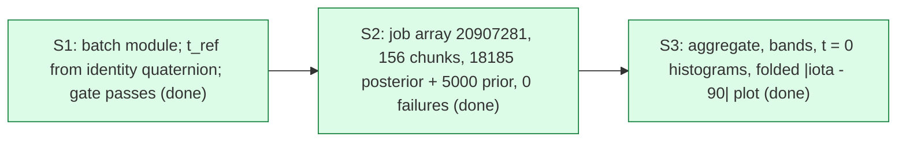

# Map: Inclination vs time over the GW231123 NRSur posterior and prior

<!-- The internal structure of this task, edited in place by the main agent after every
finished subtask: one node per subtask or line of attack, arrows for what depends on what,
and the status of each (active, done, failed, abandoned). A task with no internal structure
keeps a single node. The project graph is map/graph.md; this map shows what is inside the
task. -->

