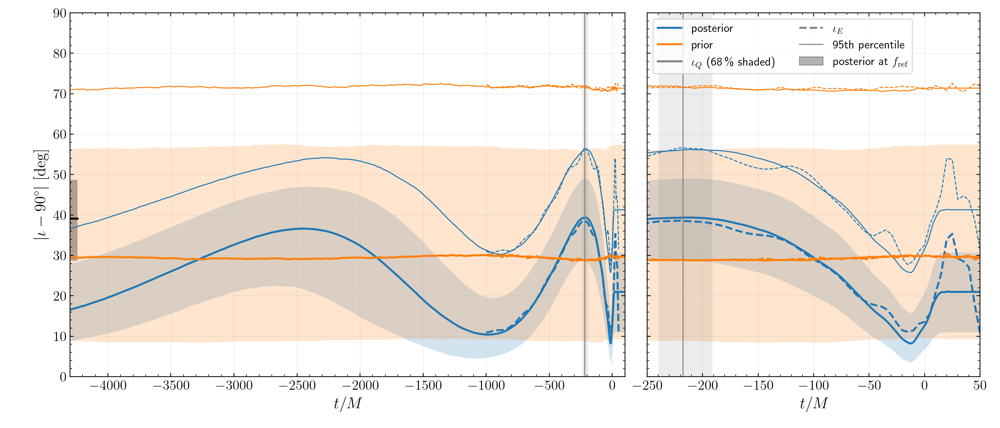
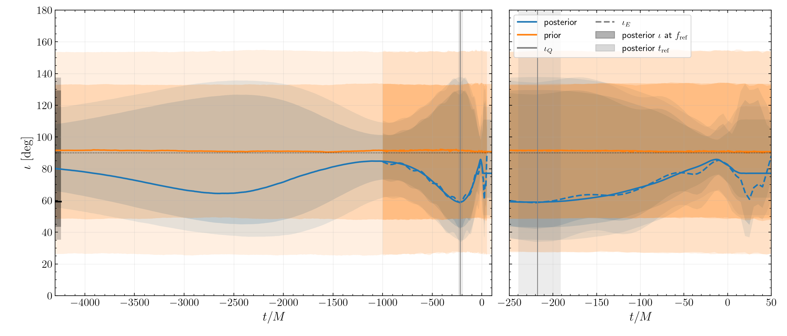

# Credible bands of $\iota_Q(t)$ and $\iota_E(t)$

Details and reading: `S3/results.md`. All numbers MEASURED from
`S3/summary_2026-09-25.json` (`S3/provenance.yaml`).

- Coverage: 18185/18185 posterior and 5000/5000 prior samples, 0 failures.
- Control: the prior median $|\iota_Q - 90^\circ|$ is $29.4^\circ$ at $f_{\rm ref}$ and
  $29.9^\circ$ at $t = 0$; the calculation adds no preference for edge-on by itself.
- The posterior $\iota$ is bimodal about $90^\circ$ (modes near $50^\circ$ and $130^\circ$ at
  $f_{\rm ref}$, near $78^\circ$ and $101^\circ$ at $t = 0$). The pointwise median of $\iota$
  lies between the modes; $|\iota - 90^\circ|$ (top figure) is unimodal.
- Limits: $\iota_Q$ is constant for $t > +20\,M$ in every sample (inferred, not tested: the
  coprecessing frame stops evolving after the ringdown). In 11.3 % of prior samples, and no
  posterior sample, the tracked $\iota_E$ switches emission lobe.
