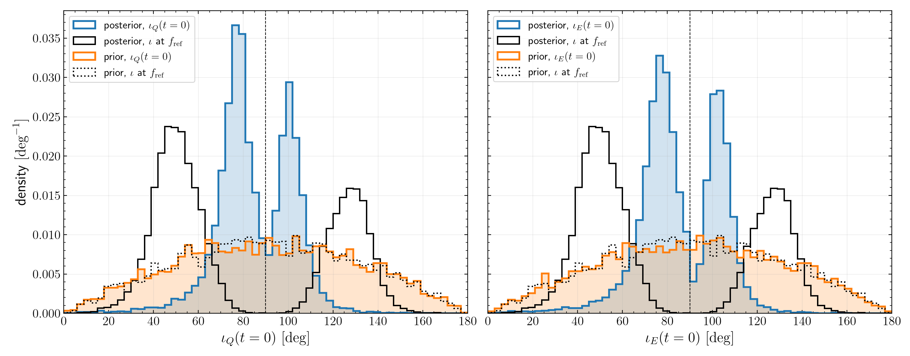

# GW231123 is close to edge-on at merger

MEASURED from `S3/summary_2026-09-25.json` (`pixi run python
tasks/t02-posterior-inclination/S3/aggregate.py`; `S3/provenance.yaml`). Degrees; median
[5 %, 95 %].

| quantity | posterior | prior |
|---|---|---|
| $\iota$ at $f_{\rm ref}$ | 59.2 [35.3, 137.5] | 90.9 [26.6, 154.6] |
| $\iota_Q(0)$ | 82.3 [60.7, 109.3] | 91.0 [26.8, 154.5] |
| $\iota_E(0)$ | 82.7 [59.3, 110.4] | 91.3 [26.3, 154.7] |
| $P(\lvert\iota - 90\rvert < 20)$: $f_{\rm ref}$ / $\iota_Q(0)$ / $\iota_E(0)$ | 0.027 / 0.823 / 0.799 | 0.353 / 0.332 / 0.342 |
| median $\lvert\iota_Q - 90\rvert$: $f_{\rm ref}$ / $t = 0$ | 39.0 / 12.6 | 29.4 / 29.9 |

Reading: the inclination at $f_{\rm ref}$, which the LVK quotes, is far from edge-on; the
orbital axis precesses so that, at merger, most posterior samples are within $20^\circ$ of
edge-on. The prior does not produce this, so it comes from the data. The result rests on the
extrapolated surrogate (`r-t01-nrsur-extrapolation`) and is quoted at $t = 0$ because the
peak time is unstable (`r-t01-peak-ambiguity`). Whether "surprisingly" edge-on holds
depends on a comparison not yet made (for example, with the $\iota_Q(0)$ distribution of
other events or of posterior draws under a different spin prior).
