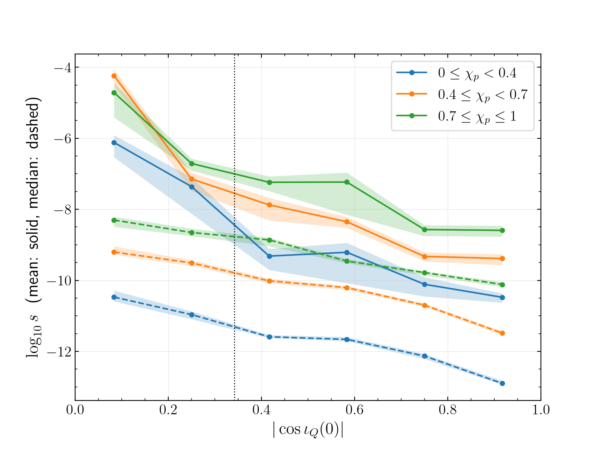
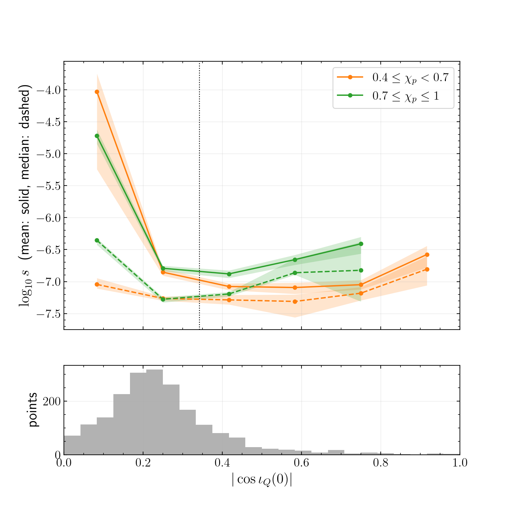
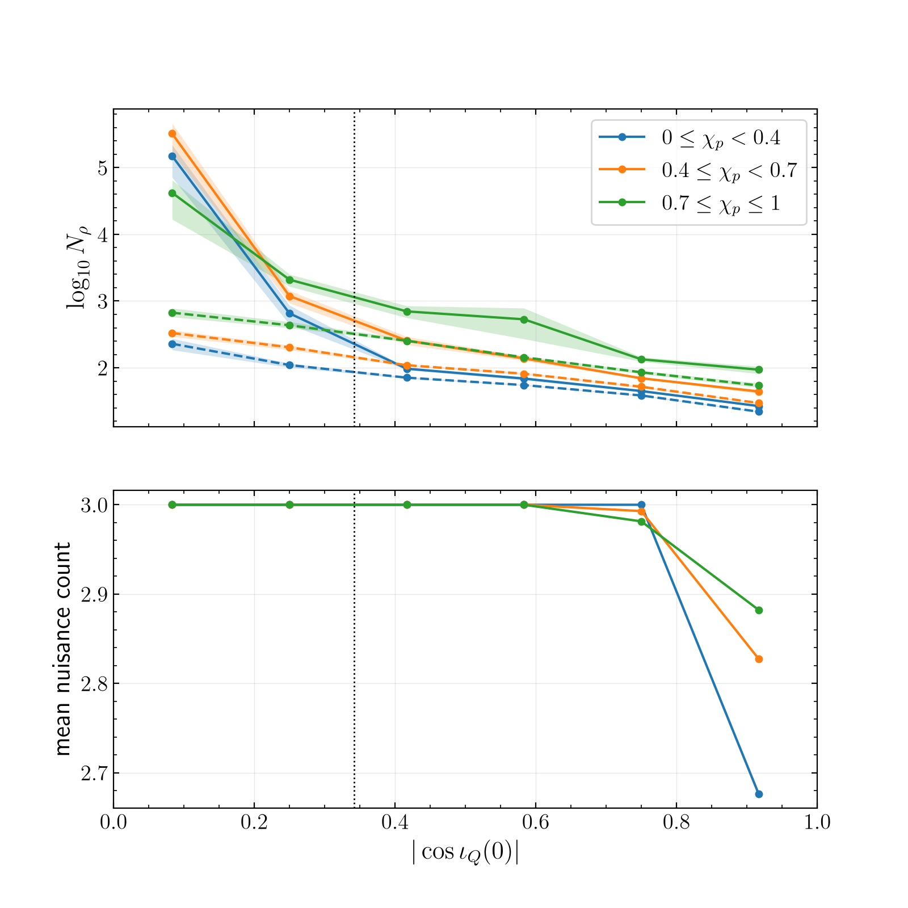

# Edge-on orientations at merger have more distinguishable waveforms per unit prior probability

**Statement.** Near GW231123 ($M\in[287.0,333.2]\,M_\odot$, $q\in[0.685,0.974]$, all spins and orientations from the PE
prior), the density of distinguishable NRSur7dq4 waveforms per unit prior probability,
$$ s=\frac{\sqrt{\det g^\theta}}{\pi_\theta(\theta)},\qquad \theta=(M,q,\vec\chi_1,\vec\chi_2,\iota_Q(0)), $$
is larger for orientations edge-on at merger. The plan's necessary condition, $R_{\rm edge}>1$ significantly, holds. Its
second part, a rise of the ratio with $\chi_p$, does not: the ratio falls slightly with $\chi_p$. The level of $s$ does rise
with $\chi_p$, by 2.2–2.8 decades in the median at every inclination, but by about the same amount edge-on and elsewhere
(`r-t03-s-vs-inclination-figure`).

| set, $\chi_p$ bin | $n$ edge / non-edge | $R_{\rm edge}$, ratio of medians (68 %) | ratio of means (68 %, not converged) |
|---|---|---|---|
| W, all | 2697 / 5303 | 18.0 (16.1–20.4) | $1.9\times10^3$ ($1.1$–$3.4\times10^3$) |
| W, $[0,0.4)$ | 1037 / 1949 | 20.7 (17.0–25.6) | $1.3\times10^3$ |
| W, $[0.4,0.7)$ | 1141 / 2339 | 16.5 (13.3–19.0) | $5.9\times10^3$ |
| W, $[0.7,1]$ | 519 / 1015 | 12.2 (9.8–14.7) | $3.6\times10^2$ |
| P, all | 1627 / 374 | 1.13 (1.03–1.21) | 94 (37–155) |

All MEASURED: `pixi run python tasks/t03-mismatch-volume/S3/aggregate.py` → `S3/summary_2026-09-25.json`
(bootstrap, 1000 resamples, each region resampled on its own).

**How it was obtained.** Mismatch metric $g^x$ of the unit-normalised H1+L1 signal (PE PSDs, 20–448 Hz, sky fixed at the
maximum-likelihood sample) over 12 coordinates by fourth-order finite differences; chart change to $\iota_Q(0)$; Schur
complement over $(\phi_{\rm ref}\ {\rm or}\ \iota,\psi,t_c)$; PE prior density $\pi_\theta$. Plan: `plan.md`; checks: `S1/controls.md`;
run: `S2/run.md` (10 001 points, 0 failures, 3.7 CPU-h).

**Robustness.**
- *Steps* (S1 deviation 2): the same 400 W points with steps halved give ratio of medians 6.66 against 6.93 at normal steps;
  median $|\Delta\log\det g^\theta|=0.011$, 95th percentile 0.21, maximum 1.38. The step choice does not change $R_{\rm edge}$.
- *One-sided differences* (3.3 % of W, 21 % of P): excluding them gives 18.4 (W) and 1.13 (P).
- *Surrogate version*: $\iota_Q(0)$ from NRSur7dq4 (v1) and v2 differ by median $0.44^\circ$, maximum $3.1^\circ$ over P; 43 of 2001
  points change edge-on classification.
- *The mean.* The 400-point subset gives a ratio of means of 7.4, the full 8000 give 1900: the mean is set by the rare
  largest values of $s$. By figure 4 of `r-t03-signal-norm-mechanism`, those are orientations where the network signal
  nearly vanishes, and $\sqrt{\det g^\theta}$ rises as $\langle h,h\rangle^{-4.5}$ there. I expect (ESTIMATED, not tested) the prior mean of $s$
  to be controlled by how close to a null the orientations come, so that the ratio of means has no stable value. The medians
  do not have this problem; I lead with them.

**Posterior set.** Among posterior samples, 81 % edge-on, $s$ hardly depends on $\iota_Q(0)$ (figure 2): the posterior does not
sit preferentially at the high-$s$ edge-on orientations of the prior. The P mean is a posterior average, not a volume per
prior mass.

**At the event's SNR.** $N_\rho$ (only directions resolved at $\rho=20.6$) also falls from edge-on to face-on, by about one
decade in the median (figure 3); all three nuisances are resolved except near face-on.

**Reading and limits.** The edge-on excess of $s$ exists but it does not grow with precession, and it comes with low
network signal strength at fixed distance (`r-t03-signal-norm-mechanism`). It is a necessary, not a sufficient, condition for
the flexibility explanation of arXiv:2607.21834 App. C. By the Laplace approximation, posterior mass in a region that fits the
data equally well scales as $\pi/\sqrt{\det g}$. A large metric volume raises the best fit a region can reach on noise or model
error, but it also lowers the region's posterior mass per unit fit. The residual-absorption test is the complementary
step and is not done here. The metric is local. Calibration uncertainty is ignored. The waveform used for derivatives
differs from the PE's by mismatch $\le3.5\times10^{-5}$ (continuous-time tapers, `S1/controls.md`). The quadratic approximation
holds to about $\pm20$ % per direction at mismatch $10^{-3}$ (S1 deviation 1). The score leaves out the distance prior. Marginalising
distance at fixed observed SNR multiplies the prior weight by $\langle h,h\rangle^{3/2}$. With it, the ratio of medians becomes
119 (W) and 7.1 (P) (supplementary, `summary_2026-09-25.json`, `signal_norm_diagnostic`). Which score to report is open for the
user.
