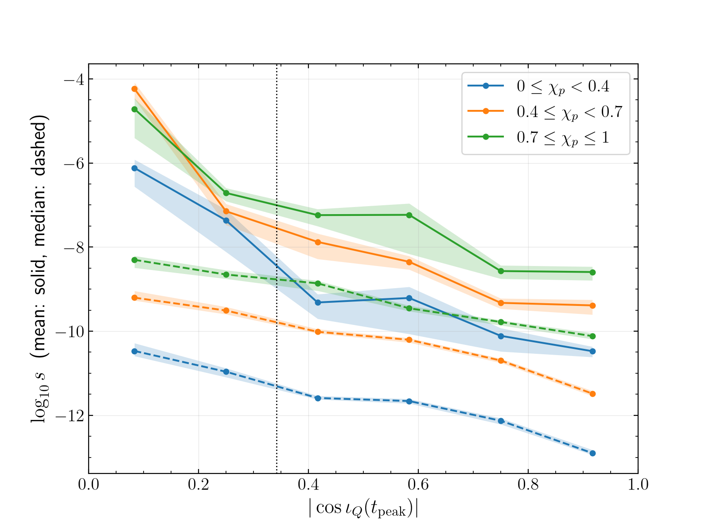

# $s$ against the inclination at the waveform peak

**Statement.** Near GW231123, the density of distinguishable NRSur7dq4 waveforms per unit prior probability,
$$ s=\frac{\sqrt{\det g^\theta}}{\pi_\theta(\theta)},\qquad \theta=(M,q,\vec\chi_1,\vec\chi_2,\iota_Q(t_{\rm peak})), $$
(1) falls from edge-on to face-on at the waveform peak in every $\chi_p$ bin, and (2) in the median, rises with precession
at every inclination. $\iota_Q(t_{\rm peak})$ is the inclination of the coprecessing-frame axis at the peak of the total mode
amplitude, written $\iota_Q(0)$ in the rest of this task.

**Numbers** (MEASURED; `pixi run python tasks/t03-mismatch-volume/S3/fig1_tpeak.py` → `S3/chi_p_trend_2026-09-25.json`;
bootstrap 68 %, 1000 resamples). $\log_{10}$ of the median of the $\chi_p\in[0.7,1]$ bin over the median of the
$\chi_p\in[0,0.4)$ bin, in the six $|\cos\iota_Q(t_{\rm peak})|$ bins from edge-on to face-on:

| quantity | 0–1/6 | 1/6–1/3 | 1/3–1/2 | 1/2–2/3 | 2/3–5/6 | 5/6–1 |
|---|---|---|---|---|---|---|
| $\log_{10}s$ | 2.17 (1.90–2.31) | 2.31 (2.17–2.46) | 2.73 (2.56–2.81) | 2.21 (2.12–2.30) | 2.35 (2.24–2.44) | 2.78 (2.67–2.87) |
| $\log_{10}\sqrt{\det g^\theta}$ | 0.85 (0.62–1.01) | 0.96 (0.85–1.07) | 1.02 (0.96–1.07) | 0.81 (0.77–0.86) | 0.87 (0.82–0.94) | 1.23 (1.16–1.28) |
| $\log_{10}(1/\pi_\theta)$ | 1.50 (1.39–1.57) | 1.41 (1.32–1.51) | 1.59 (1.51–1.70) | 1.32 (1.26–1.43) | 1.48 (1.40–1.56) | 1.47 (1.41–1.57) |

The medians of the three $\chi_p$ bins are ordered low < middle < high in all six inclination bins (figure, dashed lines).
The ratio of medians is not the sum of the parts' ratios, because the median of a sum is not the sum of the medians.

**Reading.** $s$ is a ratio of two densities on $\theta$, so it does not depend on the coordinates of $\theta$; the split
into $\sqrt{\det g^\theta}$ and $1/\pi_\theta$ does. In the Cartesian spin coordinates used here the PE prior density is
$\propto 1/(a_1^2a_2^2)$, so $1/\pi_\theta$ grows with the spin magnitudes, which are larger at large $\chi_p$. The metric factor
alone also rises with $\chi_p$, by 0.8–1.2 decades, in every inclination bin: at fixed inclination, strongly precessing
configurations have more distinguishable waveforms per unit coordinate volume. The rise with $\chi_p$ is about the same at
all inclinations. So the edge-on excess, $R_{\rm edge}$, does not grow with $\chi_p$ (20.7, 16.5, 12.2 from low to high;
`r-t03-edge-on-metric-volume`). Precession and edge-on orientation each raise $s$, and in the median the two effects add
in $\log s$ rather than reinforce each other.

**Limits.** The means (solid lines) are not converged: they are set by a few points with weak network signal
(`r-t03-signal-norm-mechanism`). The $\chi_p$ trend is stated for the medians only. $\chi_p$ is evaluated at
$f_{\rm ref}=10$ Hz. The sky position is fixed at the maximum-likelihood sample. The other limits of the metric computation
(local quadratic approximation, calibration ignored, distance prior left out) are those of `r-t03-edge-on-metric-volume`.
