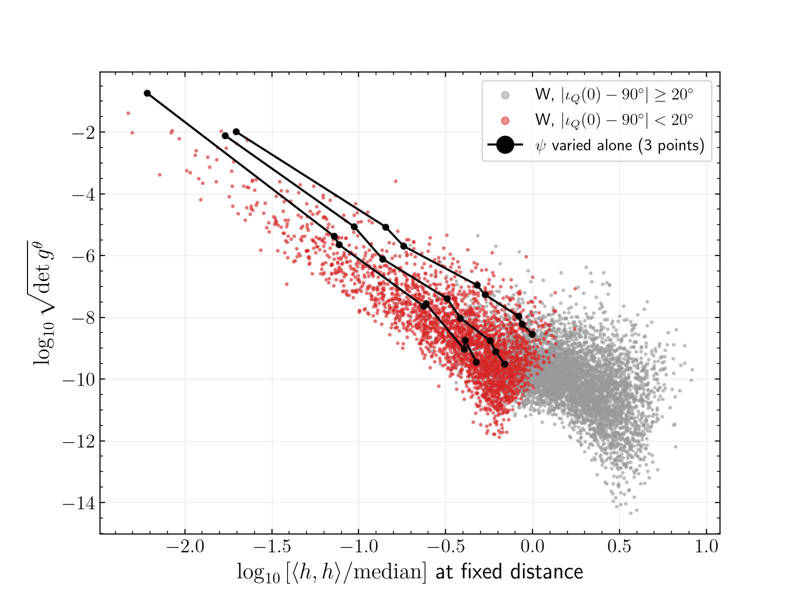

# The metric volume element grows as the network signal weakens

**Statement.** The mismatch metric of the unit-normalised H1+L1 signal is largest where the network receives a weak signal
for the source's orientation. The largest values of $s$ in `r-t03-edge-on-metric-volume` come from such orientations. An
edge-on source is nearly linearly polarised, and at some polarisation angles the co-aligned H1–L1 pair sees little of it.
The normalised waveform is then dominated by its small parts (precession and higher-mode structure, and the weaker
polarisation), and these change fast with the parameters.

**Evidence.** MEASURED, `S3/signal_norm.py`, `S3/psi_scan.py`, `S3/aggregate.py`:
- Across W: Spearman correlation of $\tfrac12\log\det g^\theta$ with $\log\langle h,h\rangle$ (1000 Mpc) is $-0.65$ (P: $-0.59$). Median
  $\langle h,h\rangle$ edge-on / non-edge-on: 0.29 (W), 0.34 (P).
- The 20 points of largest $s$ (all edge-on) have $\langle h,h\rangle$ between 0.5 % and 16 % of the median, and 0.7–21 % of the maximum
  over $\psi$ at the same point.
- Controlled test (only $\psi$ varied, 8 values in $[0,\pi/2)$) at the 3 largest-$s$ points: $\langle h,h\rangle$ changes by a factor of
  40, 50, 78; $\tfrac12\ln\det g^\theta$ changes by 17.0, 15.1, 20.1; fitted slopes $-4.5$, $-3.8$, $-4.5$. At 3 non-edge-on points of
  median $s$ the same scan changes $\langle h,h\rangle$ by only 3–23 %, so it gives no lever arm there (not a failed control).

**Limits.** The controlled test covers three points; the scaling slope near $-9/2$ is what one expects if every direction
scales as $1/\langle h,h\rangle$, but that interpretation is not tested direction by direction. Edge-on orientation and low
$\langle h,h\rangle$ are nearly collinear in W, so this analysis does not separate an edge-on effect at fixed $\langle h,h\rangle$ from the
signal-norm effect. The sky position is fixed at the maximum-likelihood sample; the antenna nulls, and so the details, depend on it.
